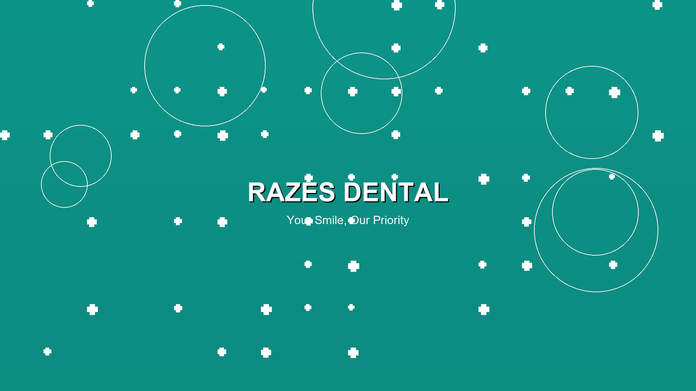
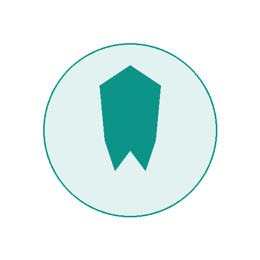
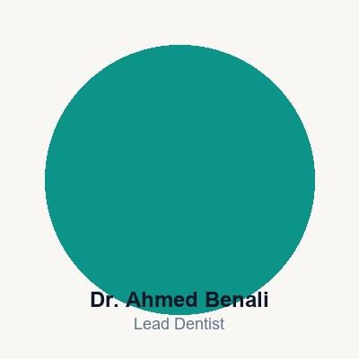
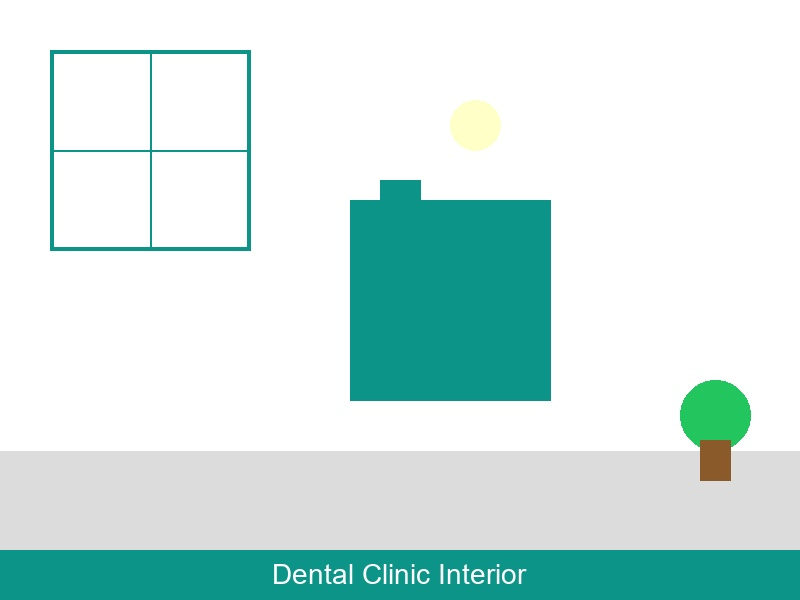
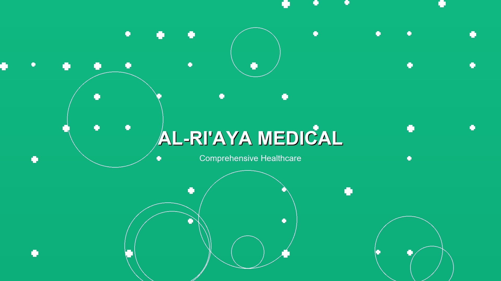
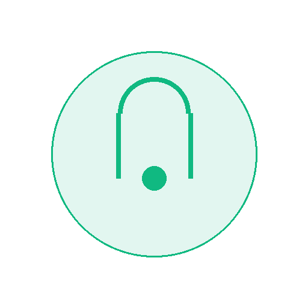
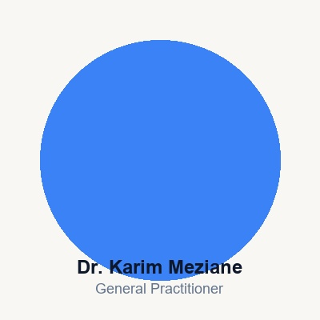
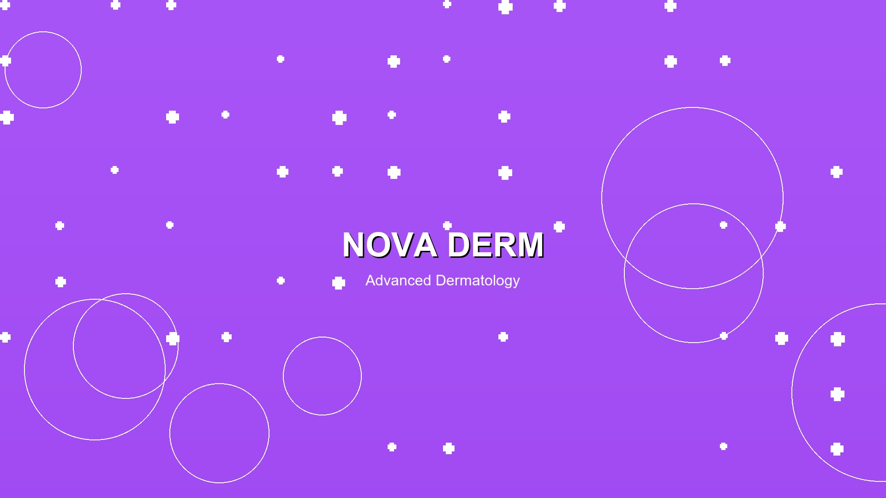
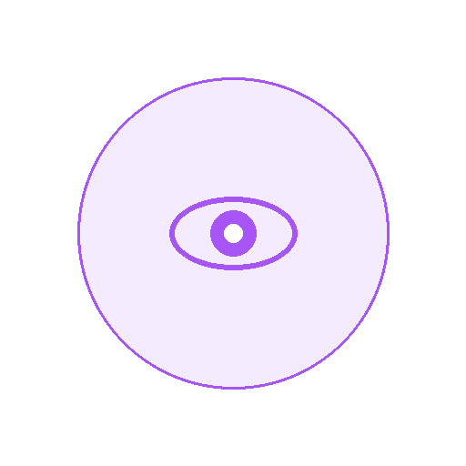
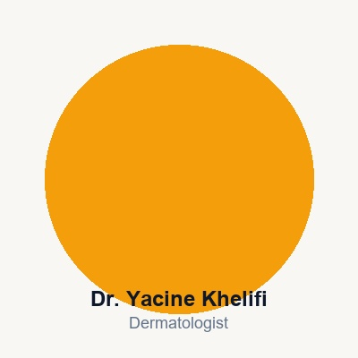

# Demo Images - Complete Summary

## All Files Created

---

### Hero Images (3)
| File | Size | Use |
|------|------|-----|
| `hero_dental.jpg` | 1920x1080px | Dental clinic hero |
| `hero_medical.jpg` | 1920x1080px | Medical clinic hero |
| `hero_dermo.jpg` | 1920x1080px | Dermatology clinic hero |

### Service Icons (6)
| File | Size | Use |
|------|------|-----|
| `icon_tooth.png` | 512x512px | Dental services |
| `icon_heart.png` | 512x512px | Cardiology |
| `icon_stethoscope.png` | 512x512px | General practice |
| `icon_syringe.png` | 512x512px | Injections |
| `icon_eye.png` | 512x512px | Ophthalmology |
| `icon_calendar.png` | 512x512px | Appointments |

### Team Placeholders (5)
| File | Size | Use |
|------|------|-----|
| `team_dentist_1.jpg` | 400x400px | Dentist placeholder |
| `team_dentist_2.jpg` | 400x400px | Dentist placeholder |
| `team_doctor_1.jpg` | 400x400px | Doctor placeholder |
| `team_doctor_2.jpg` | 400x400px | Doctor placeholder |
| `team_dermo_1.jpg` | 400x400px | Dermatologist placeholder |

### Clinic Interiors (3)
| File | Size | Use |
|------|------|-----|
| `clinic_dental.jpg` | 800x600px | Dental clinic interior |
| `clinic_medical.jpg` | 800x600px | Medical clinic interior |
| `clinic_dermo.jpg` | 800x600px | Dermatology clinic interior |

### Background Patterns (4)
| File | Size | Use |
|------|------|-----|
| `pattern_crosses.png` | 800x800px | Medical cross pattern |
| `pattern_dots.png` | 800x800px | Polka dot pattern |
| `pattern_circles.png` | 800x800px | Concentric circles |
| `pattern_waves.png` | 800x800px | Wave pattern |

### Testimonial Backgrounds (1)
| File | Size | Use |
|------|------|-----|
| `testimonial_bg.jpg` | 600x400px | Testimonial section |

### CTA Backgrounds (3)
| File | Size | Use |
|------|------|-----|
| `cta_dental.jpg` | 1200x400px | Dental call-to-action |
| `cta_medical.jpg` | 1200x400px | Medical call-to-action |
| `cta_dermo.jpg` | 1200x400px | Dermo call-to-action |

### Documentation (4)
| File | Purpose |
|------|---------|
| `23_COLOR_SYSTEM.md` | Complete color palette |
| `24_ICON_SYSTEM.md` | Icon specifications |
| `logo_design_philosophy.md` | Design philosophy |
| `21_BRAND_GUIDELINES.md` | Brand usage rules |

### Interactive Viewer (1)
| File | Purpose |
|------|------|
| `art_viewer.html` | Interactive p5.js art viewer |

---

## Total Files: 30

### By Type
- **Images:** 25
- **Documentation:** 4
- **Interactive:** 1

### By Size
- **Large (1920+):** 3
- **Medium (512-800):** 15
- **Small (400):** 5
- **Documentation:** 7

---

## How to Use

### For Dental Demo
```html
<!-- Hero -->


<!-- Services -->


<!-- Team -->


<!-- Interior -->

```

### For Medical Demo
```html
<!-- Hero -->


<!-- Services -->


<!-- Team -->

```

### For Dermo Demo
```html
<!-- Hero -->


<!-- Services -->


<!-- Team -->

```

---

## Skills Applied

### canvas-design
- Design philosophy creation
- Visual composition
- Color theory application

### algorithmic-art
- Interactive p5.js viewer
- Generative patterns
- Seeded randomness

### color-system
- Complete color palette
- Accessibility compliance
- Dark mode support

### icon-system
- Consistent icon design
- Size variants
- Usage guidelines

---

**30 files created. Ready for demo sites.**
